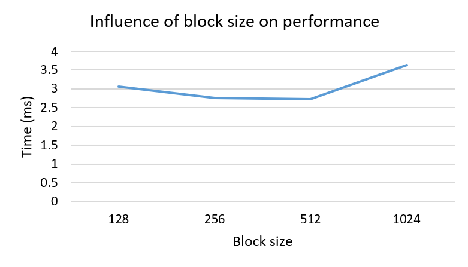
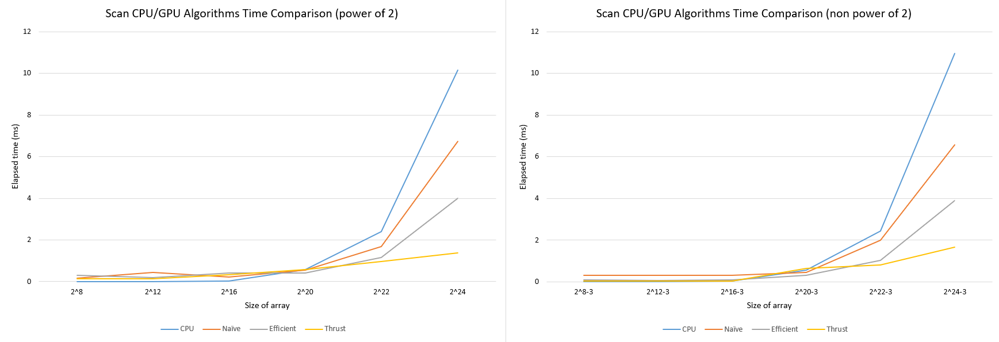
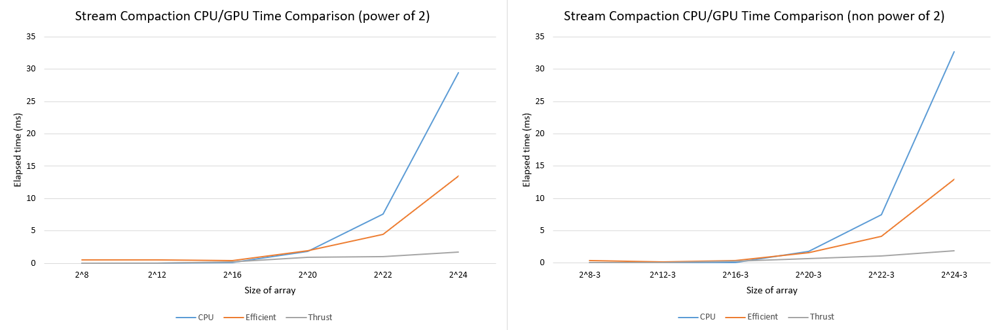
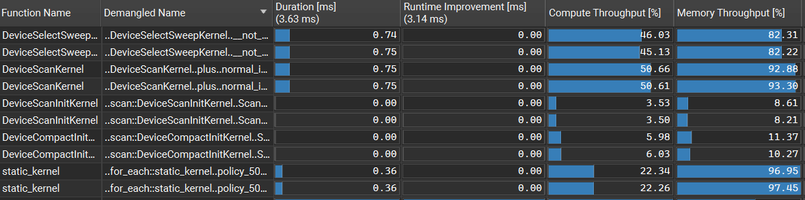
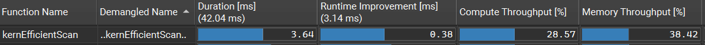
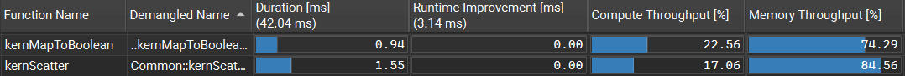

CUDA Stream Compaction
======================

**University of Pennsylvania, CIS 565: GPU Programming and Architecture, Project 2**

* Zhuoran Li
  * [LinkedIn](https://www.linkedin.com/in/zhuoran-li-856658244/)
* Tested on: Windows 11, AMD Ryzen 5 5600H @ 3.30 GHz 16.0GB, NVIDIA GeForce RTX 3050 Laptop GPU 4GB

## 1. Overview
This project implements the parallel **prefix sum (scan)** algorithm (naive and work-efficient), as well as two of its applications: **stream compaction** and **radix sort**.

### cpu.cu
- `CPU::scan`, `CPU::compactWithoutScan` and `CPU::compactWithScan` provide serial implementations used as references for testing.

### naive.cu
- `Naive::scan`: Performs an exclusive scan within each block by iteratively doubling the offset and using shared memory as a ping-pong buffer. Each thread contributes by summing its own element with a neighbor at the current offset.

  **For arrays larger than a block**, I compute a block sum (the last element of a block's scan + the last element of the input array within the block) for each block and then scan the block sum array on the host. The resulting offsets are written back to the device and added to each block's output.
  

### efficient.cu
- `Efficient::scan`: Contains a binary tree-based algorithm, including an up-sweep and a down-sweep phase. Like the naive scan, it relies on shared memory for cross-block communication.

  Since the algorithm assumes a binary tree structure, we need to pad the array to the next power of 2. To do that, I allocated another array on device with padded size, initialize all elements with 0, and copy the initial input array into the padded array.
- `Efficient::compact`: The stream compaction algorithm first maps the input array into a boolean array, marking elements with 1 and 0. An exclusive scan is then performed on this boolean array to produce target indices for the valid elements. Finally, a scatter kernel places the valid elements into their new compacted positions, and the total count is obtained from the last scanned index plus the last boolean value.


## 2. Extra Features
### 2.1. Shared Memory Allocation
Both `Naive::scan` and `Efficient::scan` load the input array into shared memory to improve performance. Shared memory is allocated dynamically at kernel launch, with the required size specified as part of the kernel configuration.

Using `Efficient::scan()` as an example:

- **Single-block case:** If only *one* block is used, we allocate `2 * n * sizeof(int)` bytes of shared memory, where `n` is the array length.

- **General case:** For arrays of arbitrary length processed across multiple blocks, we instead allocate `2 * blockDim.x * sizeof(int)` bytes per block, which is how I implemented here.

```
kernEfficientScan<<<blocks, threads, 2 * threads * sizeof(int)>>>(pad_n, d_odata, d_idata, d_blockSum);
```
Inside the kernel, the input array is first copied into a shared memory buffer:
```
extern __shared__ int temp[];
temp[2 * thid] = idata[2 * id];
temp[2 * thid + 1] = idata[2 * id + 1];
```

Notice here `thid = threadIdx.x`, `id = threadIdx.x + blockIdx.x * blockDim.x`.

In the initial version, each thread simply loaded two consecutive elements into `temp`. In the optimized version, additional steps are taken to avoid bank conflicts (see [2.2. Avoid Bank Conflicts](#2.2.-avoid-bank-conflicts)).


### 2.2. Avoid Bank Conflicts
To avoid bank conflicts in `Efficient::scan`, we add a small offset to each index so that consecutive threads are distributed across different banks. Compared to the implementation in [GPU Gem 3 Ch 39-3](https://developer.nvidia.com/gpugems/gpugems3/part-vi-gpu-computing/chapter-39-parallel-prefix-sum-scan-cuda), the key difference lies in how the input array is loaded **across blocks**. 

The reference code uses an offset of `n / 2` when assigning indices. In contrast, my implementation uses `blockDim.x` as the offset. This adjustment is necessary because each thread must access elements based on its **global index** rather than just its local position within a block.

Accordingly, calculate indices relative to the start of each block:
```
int ai = thid;
int bi = thid + blockDim.x;
// ...
int blockStart = blockIdx.x * size;
temp[ai + bankOffsetA] = idata[blockStart + ai];
temp[bi + bankOffsetB] = idata[blockStart + bi];
```

### 2.3. Radix Sort
I implemented radix sort in `Efficient::sort` inside efficient.cu. To do this, I wrote two kernels in `common.cu`: `Common::kernMapToBit` and `Common::kernRadixScatter`.

The process works like this:
- Since an integer has 32 bits, I run 32 passes.
- In each pass, I call `Common::kernMapToBit` to extract the current bit from each integer.
- Then, I call `Efficient::sort` to compute the array of indices for elements where the bit is 0.
- Next, I call `Common::kernRadixScatter` to scatter the elements into their correct positions using those indices.

For radix sort, I just use global memory because I'm lazy :).

I implement a thrust call using `thrust::sort` in `thrust.cu` as the reference. Finally, I added two tests in `main.cpp` to test the correctness of my radix sort. 

The usage of radix sort:
```
StreamCompaction::Efficient::sort(SIZE, c, a);
```

The given array and the output:
```
    [   2  10   6  37   7  38  48  27  19  31  40  30  31 ...  48   0 ]
==== thrust sort, power-of-two ====
    [   0   0   0   0   0   0   0   0   0   0   0   0   0 ...  49  49 ]
==== work-efficient sort, power-of-two ====
    [   0   0   0   0   0   0   0   0   0   0   0   0   0 ...  49  49 ]
    passed
```

### 2.4. Thrust::remove_if
I also implemented stream compaction using Thrust in `Thrust::compact` with the `thrust::remove_if` function. The code is placed in `thrust.cu`, and I added tests after the compaction tests in `main.cpp` to compare it with my own implementations.

## 3. Performance Analysis
### Block size optimization


Based on the test, performance is best with the block size of 512.

### Scan


For smaller array sizes, CPU performs better than GPU due to lower overhead in launching kernels and managing memory transfers. However, as the array size grows, the parallelism of the GPU becomes more effective, and all GPU algorithms begin to perform better than CPU. Among the GPU implementations, the work-efficient scan consistently works faster than the naive version, while Thrust achieves the best performance overall. 

### Stream Compaction


Stream compaction shows similar pattern - for smaller array size, CPU performs better. When the array size become larger, the cost of CPU grows much more faster, and GPU algorithms beats the CPU's. Thrust still performs better. 

### Nsight Analysis
Thrust: `thrust::exclusive_scan` and `thrust::remove_if`


Work-efficient scan: `kernEfficientScan`


Stream compaction: `kernMapToBoolean` and `kernScatter`


The memory throughput in thrust kernels is very high, meaning that data is loaded efficiently and bandwidth is well utilized. My work-efficient scan shows much lower memory throughput, meaning it does not achieve ideal bandwidth. Furthermore, the compute throughput of my kernels is also quite low, meaning that threads are not being kept fully busy. Thrust's scan and compaction kernels, instead, achieve relatively high compute throughput.

### Test output (array size: 2^24)
```
****************
** SCAN TESTS **
****************
    [  46  10  13  38   0  15  26  33  48  46   2  37  47 ...  37   0 ]
==== cpu scan, power-of-two ====
   elapsed time: 11.078ms    (std::chrono Measured)
    [   0  46  56  69 107 107 122 148 181 229 275 277 314 ... 410917379 410917416 ]
==== cpu scan, non-power-of-two ====
   elapsed time: 11.6785ms    (std::chrono Measured)
    [   0  46  56  69 107 107 122 148 181 229 275 277 314 ... 410917332 410917365 ]
    passed
==== naive scan, power-of-two ====
   elapsed time: 5.64531ms    (CUDA Measured)
    passed
==== naive scan, non-power-of-two ====
   elapsed time: 5.0217ms    (CUDA Measured)
    passed
==== work-efficient scan, power-of-two ====
   elapsed time: 3.21946ms    (CUDA Measured)
    passed
==== work-efficient scan, non-power-of-two ====
   elapsed time: 2.62963ms    (CUDA Measured)
    passed
==== thrust scan, power-of-two ====
   elapsed time: 1.34349ms    (CUDA Measured)
    passed
==== thrust scan, non-power-of-two ====
   elapsed time: 1.5104ms    (CUDA Measured)
    passed

*****************************
** STREAM COMPACTION TESTS **
*****************************
    [   2   2   0   3   3   0   3   3   2   0   0   2   0 ...   0   0 ]
==== cpu compact without scan, power-of-two ====
   elapsed time: 33.1457ms    (std::chrono Measured)
    [   2   2   3   3   3   3   2   2   1   3   1   1   2 ...   2   2 ]
    passed
==== cpu compact without scan, non-power-of-two ====
   elapsed time: 34.8257ms    (std::chrono Measured)
    [   2   2   3   3   3   3   2   2   1   3   1   1   2 ...   1   2 ]
    passed
==== cpu compact with scan ====
   elapsed time: 83.9328ms    (std::chrono Measured)
    [   2   2   3   3   3   3   2   2   1   3   1   1   2 ...   2   2 ]
    passed
==== work-efficient compact, power-of-two ====
   elapsed time: 2.35418ms    (CUDA Measured)
    passed
==== work-efficient compact, non-power-of-two ====
   elapsed time: 5.15379ms    (CUDA Measured)
    passed
==== thrust compact, power-of-two ====
   elapsed time: 1.65043ms    (CUDA Measured)
    passed
==== thrust compact, non-power-of-two ====
   elapsed time: 1.6233ms    (CUDA Measured)
    passed

**********************
** RADIX SORT TESTS **
**********************
    [   3  38  24  29  29  19   1  28   4  18   6  26  39 ...  10   0 ]
==== thrust sort, power-of-two ====
    [   0   0   0   0   0   0   0   0   0   0   0   0   0 ...  49  49 ]
==== work-efficient sort, power-of-two ====
    [   0   0   0   0   0   0   0   0   0   0   0   0   0 ...  49  49 ]
    passed
```
